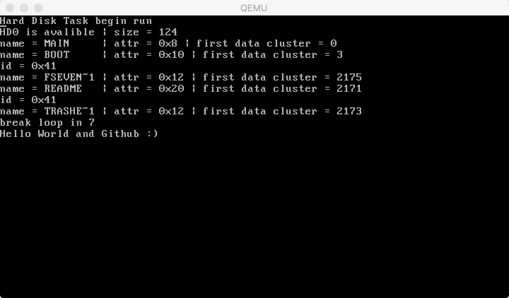

#MoonOS
## Introduction
This is a simple x86 arch Operating System, begin from OSDEV [Meaty Skeleton Tutorial](http://wiki.osdev.org/Meaty_Skeleton), and most code is writen in c/c++. The prebuild/disk.img.zip is a virtual disk which installed GRUB2 and the kernel file, after unpacking the zip file, you can use this command: `qemu-system-i386 -hda disk.img -m 32` to run the prebuild system. And you should see this bellow, and you can hit the keybard to input some words, and it will show on this screen。 This is a very simple operating system isn't it :)?:      
 
Currently only a few features have been implement.        
These features are:
> Use GRUB2's multiboot feature to boot the System.   
> Simplest page management    
> Use liballoc to do memory alloc and free    
> A __microkernel__ arch and __synchronous message__ ipc mechanism which is learned from the [Minix System](http://www.minix3.org/)    
> Simple __MultiProcess__ implemention.(for now there are only system server process running in ring 1)     
> __Keyboard driver__ and __HardDisk driver__(the hard disk driver is not ready and only can read sectors)     
> __FileSystem__(which is now in working, and only can list FAT32 root directory entry)

## Compile
&ensp; If someone is interested in this project, this part can show you how to build this baby operating system from source.    
&ensp; This project is based on CMake, and use LLVM to generate x86-elf excutable binary file, and the Assembly code use [NASM](http://www.nasm.us/). You can follow the [LLVM_Cross-Compiler](http://wiki.osdev.org/LLVM_Cross-Compiler) tutorial to build LLVM toolchain for your working platform. Theoretically both CMake and LLVM are cross platform tool, so you can compile this project on any platform. But please note, this project use llvm-lld as linker, so when you build LLVM toolchain, make sure add [llvm-lld](https://lld.llvm.org/) into compilation.     
&ensp; After setup llvm toolchain, you should modify toolchain.cmake file which is in the project's root directory. And change the ```cmake TOOL_CHAIN_ROOT``` variable to the location where you install the llvm toolchain, and run the cmake to generate project file like __Unix Makefile__ or __Codeblocks Project file__. (The Xcode in MacOS and Visual Studio can not use third-party compilers, so you can not use them to build this project)